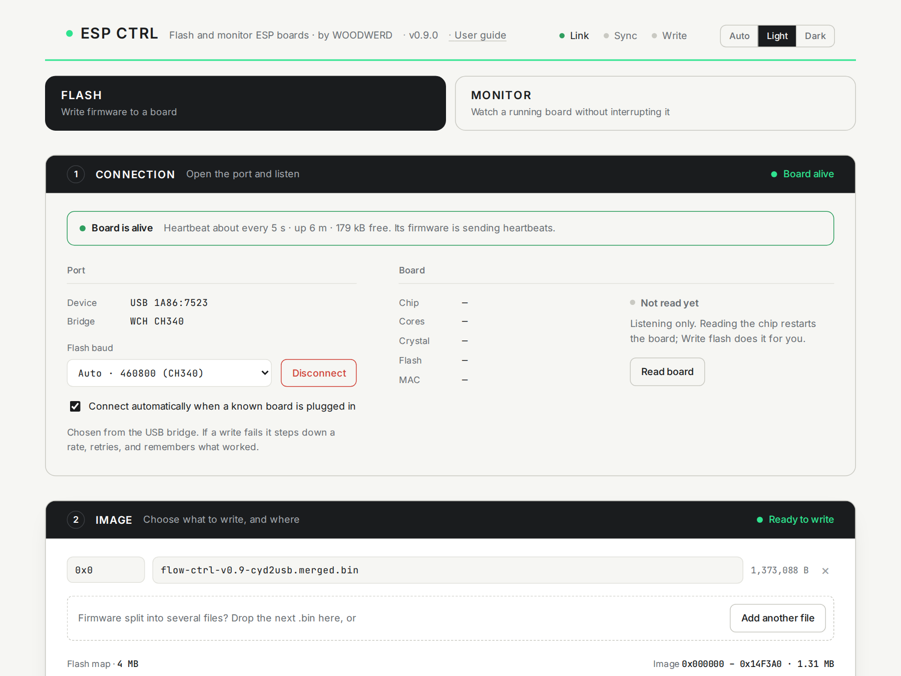

# ESP Ctrl

**Flash and monitor ESP32-family boards from your browser.** A clear, friendly front end on Espressif's
[esptool-js](https://github.com/espressif/esptool-js): the same trusted engine, a better experience around it.

**Open it: <https://woodwerd.github.io/esp-ctrl/>** · [User guide](https://woodwerd.github.io/esp-ctrl/guide.html)

## What it does

- **FLASH** writes firmware. Drop a `.bin`, click Write flash. It erases, writes, verifies (MD5) and restarts the board, with a flash map that shows where the image lands.
- **MONITOR** watches a board that is already running, without interrupting it.
- **Connecting never restarts your board.** ESP Ctrl listens first, and only puts the chip into its bootloader when you ask to read or write it.
- **Board health at a glance.** Running, crashing (it quotes the panic line), restart loop, brownout, download mode, no firmware. Add a one-line [heartbeat](https://woodwerd.github.io/esp-ctrl/guide.html#heartbeat) to your firmware and it can tell *alive* from *hung*.
- **Sensible baud rates by itself.** It recognises the USB bridge chip before opening the port (CH340 boards such as the Cheap Yellow Display get 460800), steps down and retries if a write fails, and remembers what worked.
- **Plain-language errors** that say what happened and what to do.
- **Connects by itself** after the first time, when a known board is plugged in.
- **Private.** No network requests, no analytics. Your firmware never leaves your computer.
- Light and dark themes. Nothing to install.

## Requirements

Chrome or Edge on a computer (Web Serial is not in Safari, Firefox or mobile browsers), and a USB *data* cable.
Flashing supports the ESP8266 and the ESP32 family. Monitoring works with any USB serial device.

## Run it yourself

The hosted page is the easy way. To run it offline, download this repository and either double-click
`start.command` (macOS; serves `site/` at `http://localhost:8137` and opens Chrome), or serve the `site/`
folder with any static web server. Web Serial needs `https` or `localhost`, so opening `index.html` as a
file will not work.

## Repository layout

| Path | What |
|---|---|
| `site/` | The whole app: `index.html`, `app.js`, `guide.html`, `vendor/esptool.js`, `fonts/`, `img/`. This folder is what GitHub Pages publishes. |
| `build/` | How `site/vendor/esptool.js` is produced: `cd build && npm install && npm run vendor`. |
| `start.command` | macOS launcher for running locally. |
| `.github/workflows/pages.yml` | Publishes `site/` to GitHub Pages on every push to `main`. |

There is no build step for the app itself: `app.js` is plain, readable JavaScript.

## Status and feedback

v0.9 is a public beta. So far it has been tested on Cheap Yellow Display (ESP32 + CH340) boards with Chrome on macOS. Reports
from other boards, USB bridges, Windows and Linux are exactly what it needs before 1.0: please
[open an issue](https://github.com/WOODWERD/esp-ctrl/issues) and say which board, which USB bridge (shown
in the Port panel) and which browser.

## Credits and licence

© 2026 WOODWERD LLC, [MIT licence](LICENSE). Built on esptool-js by Espressif Systems (Apache-2.0); see
[THIRD_PARTY_NOTICES.md](THIRD_PARTY_NOTICES.md) for everything it distributes.

ESP Ctrl is an independent project. It is not affiliated with or endorsed by Espressif Systems.
ESP32 and related names are trademarks of Espressif Systems.
